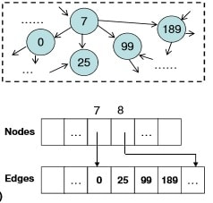
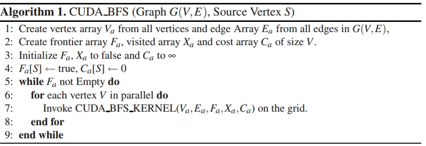
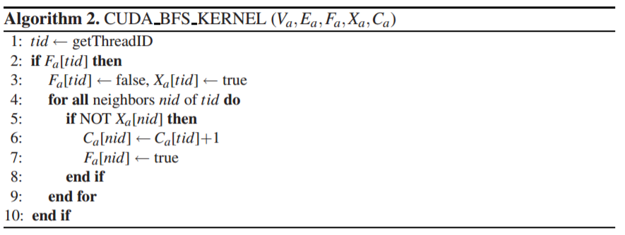

## Project Installation
1. Install cuda by using the link [a link](https://docs.nvidia.com/cuda/cuda-installation-guide-linux/index.html)
2. Clone the project
3. In the project folder go to *src* folder
4. Compile:
5. nvcc -o a.out bfs.cu
6. Run:
7. ./a.out

## Implementing Breadth First Search in CUDA

Graph algorithms are  a very common requirement in several problem domains including several scientific and engineering applications, and they mostly involve  processing large graphs having millions of vertices. In this post I’ll describe an implementation of a popular Graph Algorithm (BFS) on the GPU using CUDA.

## Bfs intro and implementation
Breadth First Search is a well known Graph Traversal Algorithm which makes use of a queue as its main data structure. In this approach we should  traverse from a selected node (source or starting node) and traverse the graph in the form of layers implying we need to keep exploring the neighboring nodes to the currently processed node. A direct implementation of the traditional BFS algorithm on the GPU may not be possible, since CUDA has a restrictive programming model and is tricky to use as well.

Instead of the traditional implementation of the BFS algorithm using a queue and Adjacency Matrix/List as graph representations, I’ve implemented a variation of the BFS Algorithm as proposed by P Harish and PJ Narayan in their paper Accelerating large graph algorithms on the GPU using CUDA.

In their paper, they present a different data structure to represent graphs in what is called a compact adjacency list form. In this structure, vertices of the graph are present in the array  Va. Another array  Ea of adjacency lists stores the edge vertices for all the vertices in the graph, such that each entry in the Vertex Array  Va refers to the starting index of its adjacent neighboring vertices in  Ea (Each entry of  Ea refers to a vertex in the vertex array Va ).

### Refer to the below picture for clarity:

### Algorithm

